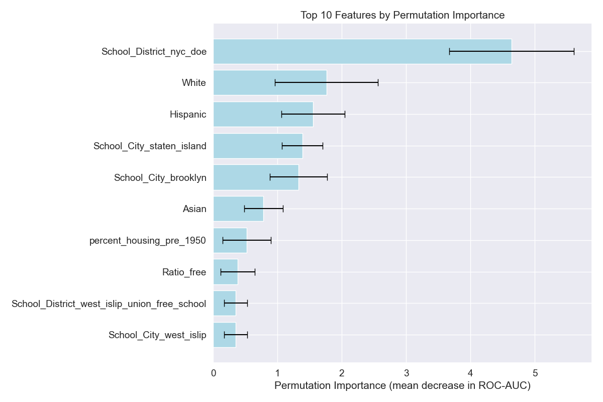

# Predicting Lead Contamination in New York Schools

Project completed for Erdos institute data science bootcamp (fall-2025)

### Team members
1. [Cami Goray](https://github.com/cgoray)
2. [Hana Lang](https://github.com/hlang-3304)
3. [Ranadeep Roy](https://github.com/ranadeep83)

## Project overview
We have developed a comprehensive analysis to predict the presence of lead contamination in New York school drinking water using a rich dataset of demographic, socioeconomic, infrastructural and geographic features. 

## Motivation and problem statement
Lead is a toxic metal that can cause health problems, especially in children. According to the CDC, “there is no safe blood lead level that has been identified for young children.” The EPA has “set the maximum contaminant level goal for lead in drinking water at zero because even small amounts can affect memory, behavior and learning ability. Unfortunately, a 2024 study from Cornell University found that 47% of schools had at least one outlet that tested above 15 ppb.

Since, any amount of lead exposure is unsafe to children, in this project we seek to answer the following question : "Can we predict whether a school has lead contaminated drinking water?"

## Stakeholders
Our primary stakeholders are education administrators in the State of New York, as well as the NY State Department of Health, New York Schools, and NY parents and families of schoolchildren, as this project aims to predict lead contamination and therefore improve safety of school facilities. 

## Dataset

1. We obtained our primary dataset from New York’s Department of Health. Our target variable is a binary: 1 if there is a drinking outlet with above five parts per billion (>5 ppb) lead contamination, and 0 if there are no such drinking outlets. This level is recommended by the New York Public Health Law, which governs school potable water testing standards.
2. Our predictive features include school name, school district, percentage of students on free or reduced lunch, student-teacher ratio, demographic enrollment percentages (White, Black, Hispanic, Native American, Multiple Races) per school, and percentage of buildings in each county built before 1950, since building materials pre-1950 were more likely to contain lead in plumbing and paint materials. We obtained this data by scrapping [nces website](https://nces.ed.gov/ccd/schoolsearch/)

## Modeling approach
The dataset was split into training and testing sets, with 20% of the data set aside as the final test set. For each model, we performed hyperparameter tuning with nested cross validation using random search. Models were considered in increasing order of complexity: logistic regression (with and without penalty), decision trees, support vector machines, random forest, AdaBoost and XGBoost. All the models were evaluated on the basis of mean ROC-AUC scores. This metric was chosen because our dataset was nearly balanced and we wanted to ensure that our model can distinguish between the two classes well.

## Results
1. Hyperparameter-tuned logistic regression model produced the best mean AUC score in the training stage, with an average ROC-AUC score of 0.7621 across the five outer folds of the nested cross-validation.
2. On the final test set we obtained an ROC-AUC score of 0.7278 on the validation set using the Logistic Regression with penalty and the best hyperparameters found in the training stage. The corresponding confusion matrix is shown below :

3. Feature importance analysis based on permutation importance methods indicates that the most important features of a school were: 
    -   (a) school district of NYC Department of Education
    -   (b) the proportion of white students 
    -   (c) the proportion of Hispanic students 
    -   (d) a city location of Staten Island 
    -   (e) a city location of Brooklyn. 

Based on EDA, we had expected geographical features to appear as important predictors consistentwith the county-wide heat map displaying the proportion of schools with target variable.

## Conclusion and future directions
1. Geographical features (school district and city) are strong predictors of whether or not a school has lead-contaminated water. In further work, we would explore other features capturing why location plays a critical role in lead detection.
2. To investigate why location plays a critical role, we would include incorporating spatial modeling to identify “hotspots” of elevated lead levels, including water system maps and pollution metrics. We would also hope to obtain institution-specific building age for future modeling, rather than using a county-wide metric.
3. Obtain more socioeconomic data, for example school board funding, with the hypothesis that better funded schools serving wealthier students might be more likely to have already addressed elevated lead levels in drinking water.
4. Finally, lead contamination in school drinking water is not a problem limited to New York State. In future work, we would look to expand modeling to include other states. 

## Folder organization
1. data : This folder contains the main dataset "Lead_Testing_in_Schools.csv" obtained from [New York department of health website](https://health.data.ny.gov/Health/Lead-Testing-in-School-Drinking-Water-Sampling-and/rygk-rhum/about_data). It also contains a script "scraping_all_schools.ipynb" to scrap socio-economic and demographics data from [nces website](https://nces.ed.gov/ccd/schoolsearch/ ) and other datasets obtained from [NYC government site](https://a816-dohbesp.nyc.gov/IndicatorPublic/data-explorer/lead/?id=16#display=summary). The final dataset used for modeling is "lead_data_expanded.csv" which can be generated using "combine_csv.ipynb"
2. eda_and_images : This folder conains python notebooks to perform exploratory data analysis on the data.
3. model_comparison : This folder contains scripts for performing model evaluation and testing the final model. It also contains the executive summary and rpesentation pdfs.
